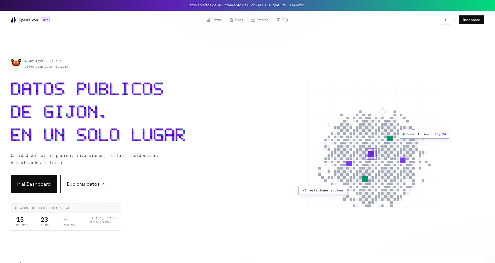

# OpenXixón

[](LICENSE)
[](https://astro.build)
[](https://supabase.com)
[](https://openxixon.vodtinker.dev)

**Portal de datos abiertos del Ayuntamiento de Gijón** con API REST gratuita y modelo freemium.

Accede a datos en tiempo real de calidad del aire, incidencias urbanas, población, multas de tráfico e inversiones públicas de Gijón (Asturias, España) con una sola petición HTTP. Sin burocracia.

> **🌐 Demo:** [openxixon.vodtinker.dev](https://openxixon.vodtinker.dev)



---

## Datasets disponibles

| Endpoint | Descripción |
|---|---|
| `GET /api/aire` | Calidad del aire por estaciones (ICA, NO₂, PM2.5, O₃) |
| `GET /api/incidencias` | Incidencias urbanas (tipo, estado) |
| `GET /api/poblacion` | Padrón municipal (global y por barrios) |
| `GET /api/multas` | Multas de tráfico por año y calificación |
| `GET /api/inversiones` | Contratos y licitaciones públicas |

Todos los endpoints aceptan autenticación vía API key (`Authorization: Bearer <key>`) o sesión de usuario. Sin autenticación se aplican los límites del plan Free.

### Ejemplo rápido

```bash
# Sin registro — plan Free
curl https://openxixon.vodtinker.dev/api/aire

# Con API key — plan Pro
curl -H "Authorization: Bearer TU_API_KEY" \
     https://openxixon.vodtinker.dev/api/aire
```

---

## Modelo de acceso

| Plan | Histórico | Límite diario | Precio |
|---|---|---|---|
| **Free** (sin registro) | 30 días | 100 req/día | Gratis |
| **Pro** | 1 año | 10.000 req/día | Próximamente |

---

## Stack

- **Framework:** [Astro](https://astro.build) SSR (`@astrojs/node`, modo standalone)
- **Base de datos + Auth:** [Supabase](https://supabase.com)
- **Hosting:** VPS con [Cloudflare](https://cloudflare.com) como proxy CDN
- **Ingesta de datos:** Supabase Edge Functions (cron diario 3am UTC)
- **Pagos:** Stripe / LemonSqueezy (configurable vía variables de entorno)

---

## Self-hosting en 5 minutos

### 1. Requisitos previos

- Node.js ≥ 22 o [Bun](https://bun.sh)
- Proyecto en [Supabase](https://supabase.com) (plan gratuito suficiente)
- (Opcional) cuenta en Stripe o LemonSqueezy para pagos

### 2. Clonar e instalar

```bash
git clone https://github.com/vodtinker/openxixon.git
cd openxixon
bun install
```

### 3. Configurar variables de entorno

```bash
cp .env.example .env
# Editar .env con tus credenciales
```

Variables mínimas para desarrollo (sin pagos):

```env
PUBLIC_SUPABASE_URL=https://<ref>.supabase.co
PUBLIC_SUPABASE_ANON_KEY=<anon-key>
SUPABASE_SERVICE_ROLE_KEY=<service-role-key>
```

Ver `.env.example` para la lista completa con comentarios.

### 4. Inicializar la base de datos

Ejecuta el SQL completo en el editor de Supabase:

```bash
# Supabase SQL Editor o CLI:
supabase db push --local   # si usas Supabase local
# o copia y pega supabase/schema.sql en el editor web
```

### 5. Arrancar en desarrollo

```bash
bun dev
# → http://localhost:34322
```

### 6. Build y producción

```bash
bun run build
node dist/server/entry.mjs
```

Puedes usar PM2 o systemd para mantenerlo en ejecución.

---

## Ingesta de datos (Edge Function)

Los datos se actualizan automáticamente desde las APIs del Ayuntamiento de Gijón cada noche a las 3am UTC:

```bash
supabase functions deploy ingesta
```

La función está en `supabase/functions/ingesta/index.ts`.

---

## Estructura del proyecto

```
src/
  pages/
    api/          → endpoints REST (delgados, sin lógica de negocio)
    app/          → área privada de usuario
    auth/         → flujo OAuth de Supabase
  lib/
    api-auth.ts   → resuelve plan e identidad del llamante (API key / sesión)
    supabase.ts   → cliente Supabase SSR
    tier.ts       → constantes de límites por plan
    stripe.ts     → integración Stripe
    lemonsqueezy.ts → integración LemonSqueezy
    data/         → capa de acceso a datos (una función por dataset)
  layouts/        → Layout público + AppLayout para el dashboard
  components/     → Nav, Footer, gráficos, etc.
  middleware.ts   → protege /app/* redirigiendo a /login
supabase/
  schema.sql      → DDL completo de todas las tablas
  functions/      → Edge Functions de ingesta
```

---

## Contribuir

Las contribuciones son bienvenidas. Por favor lee [CONTRIBUTING.md](CONTRIBUTING.md) antes de abrir una PR.

1. Abre un issue describiendo el cambio antes de hacer una PR grande
2. Sigue el estilo de código existente (TypeScript strict, Astro SSR)
3. Ejecuta `bun run check` antes de hacer commit

---

## Licencia

MIT © [VodTinker](https://vodtinker.dev)
